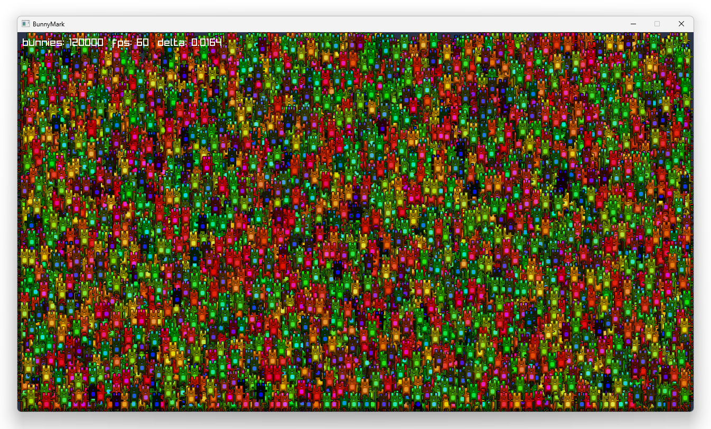

# Odin + raylib BunnyMark

A tiny, fast BunnyMark-style sprite benchmark written in **Odin** with **raylib**.
Single texture, per-sprite color tint, and simple per-frame physics.



> Tested with **Odin** `dev-2025-09-nightly:42c2cb8` and **raylib** `5.5`.

---

## Features

- 🐇 Adds/removes bunnies in big batches
- 🎨 Per-sprite tint (HSV → RGB) for colorful sprites
- 📦 Single-texture rendering to keep raylib’s internal batching intact
- 🧮 Simple per-frame “gravity + bounce” physics
- 🔧 Minimal dependencies and ~200 lines of clear code

---

## Controls

| Action | Mouse / Key | Effect |
|---|---|---|
| Add bunnies | Left Click | +1000 (×10 with **Shift**) |
| Remove bunnies | Right Click | −1000 (×10 with **Shift**) |
| Close | Esc / Window Close | Exit |

---

## Build & Run

> Requires Odin `dev-2025-09-nightly:42c2cb8` and raylib `5.5` (Odin bindings).  
> The code imports `vendor:raylib`; make sure your Odin setup provides that binding.

```bash
# Optimized build (recommended)
odin build . -o:speed -no-bounds-check

# Then run the produced binary as usual
```

**Why these flags?**

- `-o:speed` enables an optimized build.
- `-no-bounds-check` removes array bounds checks in hot loops for extra performance.
  (Keep them on while debugging; turn off for release/benchmarks.)

---

## Project Structure

```
.
├─ main.odin            # All code in one file for simplicity
└─ assets/
   └─ wabbit_alpha.png  # Bunny texture
```

---

## Performance Notes

- Using a **single texture** for all sprites lets raylib batch draw calls efficiently.
- `DrawTextureV` accepts `f32` positions, so you get smooth sub-pixel motion.
- For maximum pixel throughput, switch filter to `POINT`:
  ```odin
  rl.SetTextureFilter(bunny_tex, rl.TextureFilter.POINT)
  ```

If you want **frame-rate independent** motion, convert velocities to px/s and integrate with `dt = rl.GetFrameTime()`. (The current code is intentionally frame-based for classical BunnyMark behavior.)

---

## Acknowledgements

- [raylib](https://www.raylib.com) — a simple and easy-to-use library to enjoy videogames programming.
- [Odin language](https://odin-lang.org) — fast, pragmatic, and great for game experiments.

---

## License

MIT — see [`LICENSE`](./LICENSE).
